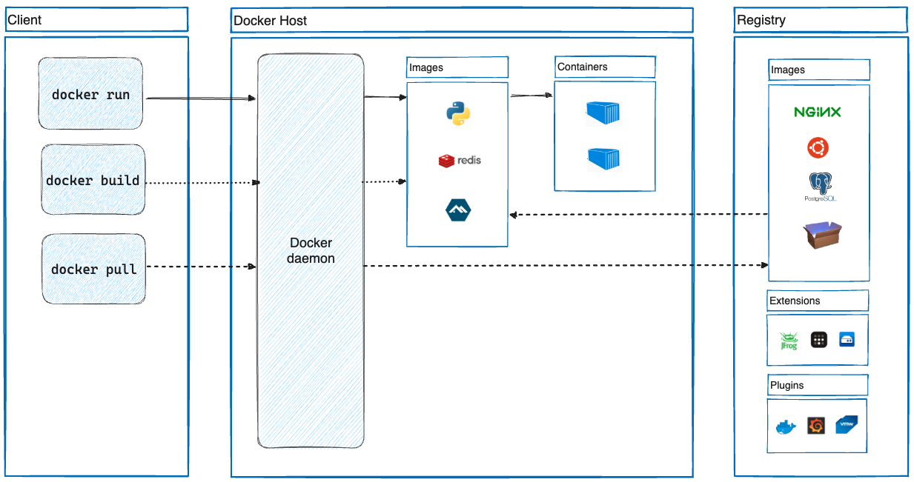

## Docker
This repo is maintained for docker
[Docker_overview](https://docs.docker.com/get-started/overview/)

### Before we start with Docker, lets first understand the Virtual Machine and why concept of container came into picture

## Virtual machine:
A virtual machine is an advancement to Physical machines where multiple Guest VM's are created on top of physical host machine with a concept of Hypervisor or virtualization.
The resources like cpu, storage, RAM etc  of Host machine will be shared across these VM's
Each VM has its own Guest OS running on Host OS.
    
  1. if host machine is Linux, then guest machines can be Linux, windows or macos
  2. if host machine is windows, then guest machines are windows only
  3. You have to specifically alot the resources to VM's like 25gb of storage and still there will be wastage of resouces if application installed on it doesn't use it-> to overcome this problem, containers concept came into picture
  4. Another main reason is that developers maybe using windows while writing code and is succesful, but when code comes to Testing team for Testing who are using Macos or maybe windows with different software versions , then code may break even if its succesful  in developer machine. 
  5. Hence the Base image is used in dockerfile like ubuntu or centos etc so that it acts as guest os and downloads all dependencies etc on it without any issues with no platform dependency of what physical machine is windows/linux/macos but utilize the resources like cpu, ram etc

## Containers:
Containers are advancement to VM's. 
A container is a package or bundle which contains the application package + application dependencies/libraries + OS system dependencies like if application requires python etc

  1. Containers are lightweight and contain everything needed to run the application, so you don't need to rely on what's installed on the host
  2. Containers do not have a complete Operating system like VM, they share resources from host machine
  3. Containers are created on top of Docker platform(a software) and shares the same Host OS along with resources and there is no guest OS
  4. Containers can be created in 2 ways 
  ```
    - `Model1`: deploy docker on Physical machine 
    - `Model2`: deploy docker on Virtual machine, where VM is created on physical machine (model2 is mostly used)
  ```

## How to create container/Life cycle of docker: 
   we need to run  Docker commands for below execution on docker engine:
 ```
  Write a DockerFile -> Build/Execute on Docker platform/Docker Engine -> this will convert file into Docker image  -> covert Docker image to Docker container`
  ```

## What is Docker?
 Docker is a containerization platform where you can build, run the applications in an isolated environment called container and push these containers to Docker public/private registry

## Docker Architecture



## Architecture components in Simple terms

1. `Docker Client` -> a CLI /terminal where a user executes commands like build, run, pull
2. `Docker Daemon` -> is the background process that listens to Docker API requests through commands to create or manage Docker objects like images/run containers, networks, volumes etc
`Note`: Docker Daemon is the heart of Docker and if its crash/down for any reason, containers will not be responsive
3. `Docker Host` -> After execution of these commands, images and containers are created
4. `Docker Registry` -> central location where you store Docker images. you can pull and push these images from/to public/private registry
5. `Docker Hub` -> is a Docker public registry 

## Docker Objects
1. `Dockerfile` -> This file contains the steps/ list of commands to be executed to build Docker image
2. `Docker image` -> A read-only template to create Docker container (similar to a image template(ISO image/Amazon ami that contains os,softwares required to run a machine)
3. `Docker Container` -> is a package of a application, dependencies, runtime to run a application
4. `Docker Volume` -> A Docker volume is an independent file system entirely managed by Docker and exists as a normal file or directory on the host, where data is persisted(data is permanent even if docker container goes down)
5. `Docker Network` -> Docker Networks are used to provide complete isolation for Docker containers

# CONS of using Docker:

Docker is a single point of failure, incase if docker engine crash/down for any reason, all your containers wont be available


